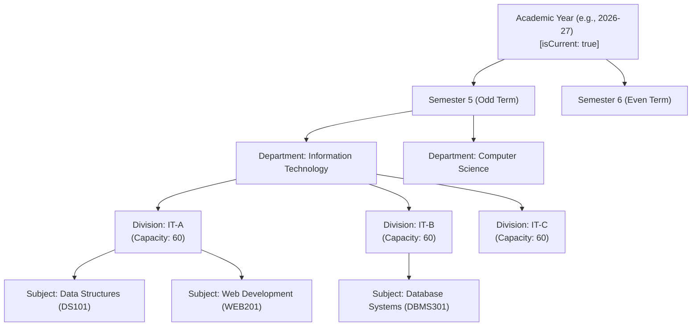
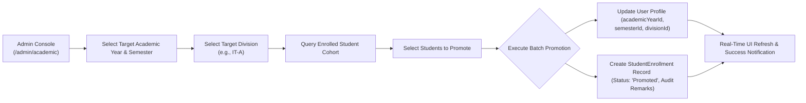
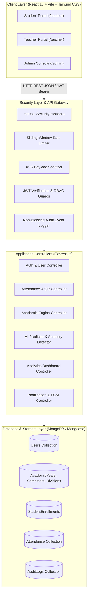
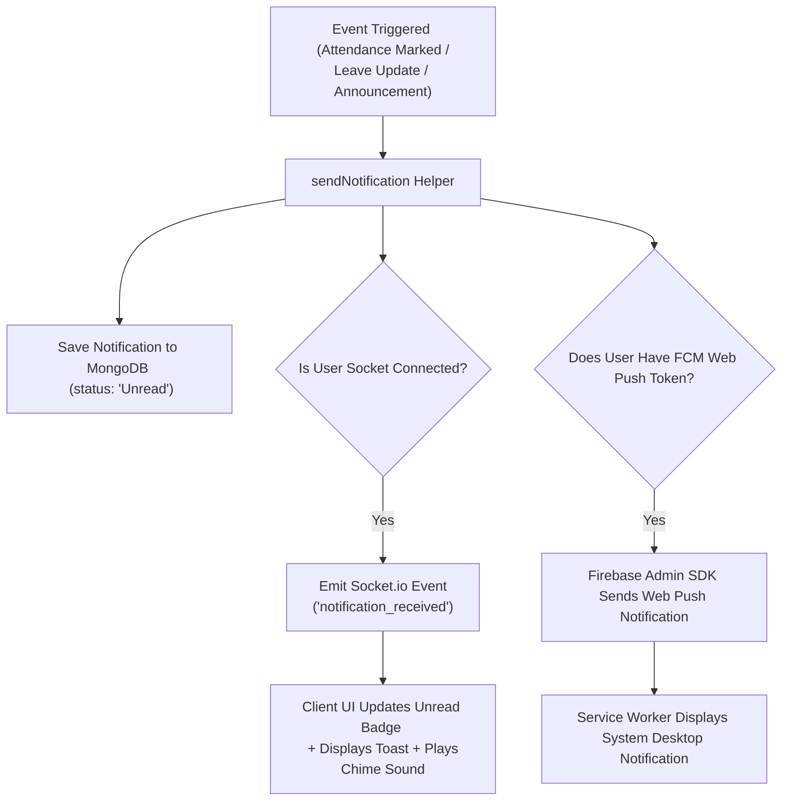
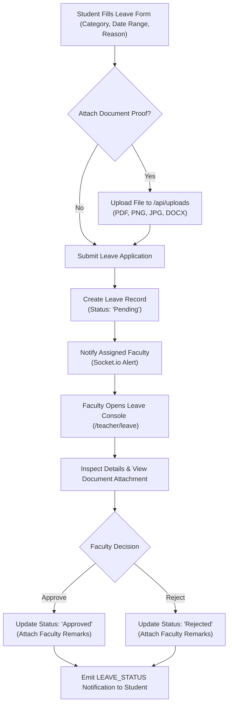
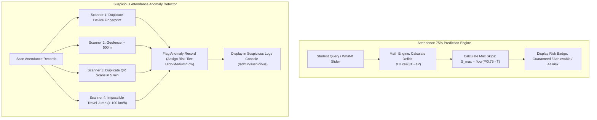

# System Architecture & Workflow Diagrams

This document contains comprehensive flowcharts and system diagrams for the **Attendance Management System**, rendered using standard GitHub Flavored Markdown [`mermaid`](https://mermaid.js.org/) syntax.

---

## 📋 Table of Contents
1. [Dynamic Academic Hierarchy Tree](#1-dynamic-academic-hierarchy-tree)
2. [Student Batch Promotion Engine Workflow](#2-student-batch-promotion-engine-workflow)
3. [30-Second Dynamic QR Attendance & Security Verification Flow](#3-30-second-dynamic-qr-attendance--security-verification-flow)
4. [Overall System Architecture & Data Pipeline](#4-overall-system-architecture--data-pipeline)
5. [Real-Time Socket.io & FCM Web Push Notification Flow](#5-real-time-socketio--fcm-web-push-notification-flow)
6. [Student Leave Application & Authorization Flow](#6-student-leave-application--authorization-flow)
7. [AI Attendance Prediction & Proxy Anomaly Detection Flow](#7-ai-attendance-prediction--proxy-anomaly-detection-flow)

---

## 1. Dynamic Academic Hierarchy Tree

The Phase 18 Academic Engine organizes institutional data into a dynamic 5-tier hierarchy, replacing hard-coded term strings:

---

## 2. Student Batch Promotion Engine Workflow

Process flow for promoting student cohorts from a current academic term to a target academic term:

---

## 3. 30-Second Dynamic QR Attendance & Security Verification Flow

Complete multi-layered security verification process when a student scans a 30-second expiring QR code:

---

## 4. Overall System Architecture & Data Pipeline

3-Tier Architecture showing Client SPA, Security Gateway, Application Services, and MongoDB Storage:

---

## 5. Real-Time Socket.io & FCM Web Push Notification Flow

Architecture of event-driven notification dispatch system across WebSockets and Firebase Cloud Messaging:

---

## 6. Student Leave Application & Authorization Flow

Step-by-step leave lifecycle from application submission to faculty authorization:

---

## 7. AI Attendance Prediction & Proxy Anomaly Detection Flow

Math trajectory calculation and security anomaly scanning flow:

