# System Architecture & Workflow Diagrams

This document contains comprehensive flowcharts and system diagrams for the **Attendance Management System**, rendered using standard GitHub Flavored Markdown [`mermaid`](https://mermaid.js.org/) syntax.

---

## 📋 Table of Contents
1. [Dynamic Academic Hierarchy Tree](#1-dynamic-academic-hierarchy-tree)
2. [Student Batch Promotion Engine Workflow](#2-student-batch-promotion-engine-workflow)
3. [30-Second Dynamic QR Attendance & Security Verification Flow](#3-30-second-dynamic-qr-attendance--security-verification-flow)
4. [Overall System Architecture & Data Pipeline](#4-overall-system-architecture--data-pipeline)
5. [Real-Time Socket.io & FCM Web Push Notification Flow](#5-real-time-socketio--fcm-web-push-notification-flow)
6. [Student Leave Application & Authorization Flow](#6-student-leave-application--authorization-flow)
7. [AI Attendance Prediction & Proxy Anomaly Detection Flow](#7-ai-attendance-prediction--proxy-anomaly-detection-flow)
8. [Advanced Attendance Rules Engine Evaluation & Sandbox Flow](#8-advanced-attendance-rules-engine-evaluation--sandbox-flow)
9. [Attendance Session Engine & 4-Tier Hierarchy Flow](#9-attendance-session-engine--4-tier-hierarchy-flow)
10. [Anti-Proxy Multi-Signal Risk Engine & Review Workflow](#10-anti-proxy-multi-signal-risk-engine--review-workflow)
11. [Attendance Correction Request & Approval Workflow](#11-attendance-correction-request--approval-workflow)
12. [Complete Institutional Audit Logging & State Mutation Pipeline](#12-complete-institutional-audit-logging--state-mutation-pipeline)
13. [Phase 25 Advanced Notification Engine & Multi-Channel Pipeline](#13-phase-25-advanced-notification-engine--multi-channel-pipeline)
14. [Phase 26 Attendance Forecasting Engine & Scenario Simulator](#14-phase-26-attendance-forecasting-engine--scenario-simulator)
15. [Phase 27 Personal Student Analytics & Visual Threshold Engine](#15-phase-27-personal-student-analytics--visual-threshold-engine)
16. [Phase 28 Teacher Analytics & Classroom Insights Engine](#16-phase-28-teacher-analytics--classroom-insights-engine)
17. [Phase 29 Admin Intelligence Dashboard & College Control Center Dataflow](#17-phase-29-admin-intelligence-dashboard--college-control-center-dataflow)
18. [Phase 30 Automated Defaulter Management & Escalation Pipeline](#18-phase-30-automated-defaulter-management--escalation-pipeline)
19. [Phase 31 Parent/Guardian Portal & Ward Monitoring Lifecycle](#19-phase-31-parentguardian-portal--ward-monitoring-lifecycle)
20. [Phase 31 Document Verification & Security Storage Pipeline](#20-phase-31-document-verification--security-storage-pipeline)
21. [Phase 33 PWA Service Worker & Camera QR Scanning Architecture](#21-phase-33-pwa-service-worker--camera-qr-scanning-architecture)
22. [Phase 34 Offline Attendance Sync & Multi-Strategy Conflict Resolution Flow](#22-phase-34-offline-attendance-sync--multi-strategy-conflict-resolution-flow)

---

## 1. Dynamic Academic Hierarchy Tree

The Phase 18 Academic Engine organizes institutional data into a dynamic 5-tier hierarchy, replacing hard-coded term strings:

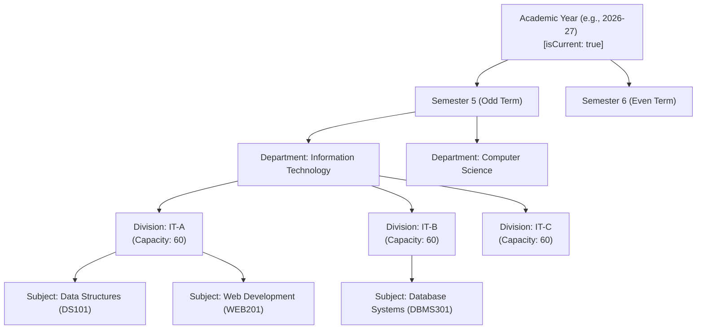

---

## 2. Student Batch Promotion Engine Workflow

Process flow for promoting student cohorts from a current academic term to a target academic term:

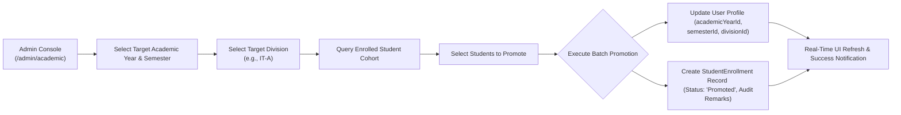

---

## 3. 30-Second Dynamic QR Attendance & Security Verification Flow

Complete multi-layered security verification process when a student scans a 30-second expiring QR code:


---

## 4. Overall System Architecture & Data Pipeline

3-Tier Architecture showing Client SPA, Security Gateway, Application Services, and MongoDB Storage:

```mermaid
flowchart TB
    subgraph ClientLayer ["Client Layer (React 18 + Vite + Tailwind CSS)"]
        UI_Student["Student Portal (/student)"]
        UI_Teacher["Teacher Portal (/teacher)"]
        UI_Admin["Admin Console (/admin)"]
    end

    subgraph SecurityGateway ["Security Layer & API Gateway"]
        Helmet["Helmet Security Headers"]
        RateLimiter["Sliding-Window Rate Limiter"]
        XSS["XSS Payload Sanitizer"]
        JWT_RBAC["JWT Verification & RBAC Guards"]
        AuditMiddleware["Non-Blocking Audit Event Logger"]
    end

    subgraph ControllerLayer ["Application Controllers (Express.js)"]
        AuthCtrl["Auth & User Controller"]
        AttCtrl["Attendance & QR Controller"]
        AcadCtrl["Academic Engine Controller"]
        AICtrl["AI Predictor & Anomaly Detector"]
        AnalyticCtrl["Analytics Dashboard Controller"]
        NotifCtrl["Notification & FCM Controller"]
        AuditCtrl["Audit & Correction Controllers"]
    end

    subgraph DB ["Database & Storage Layer (MongoDB / Mongoose)"]
        Col_Users[("Users Collection")]
        Col_Academic[("AcademicYears, Semesters, Divisions")]
        Col_Enrollment[("StudentEnrollments")]
        Col_Att[("Attendance & Sessions")]
        Col_Correction[("AttendanceCorrections")]
        Col_Audit[("AuditLogs (10 Actions + State Diffs)")]
    end

    ClientLayer -->|HTTP REST JSON / JWT Bearer| SecurityGateway
    SecurityGateway --> ControllerLayer
    ControllerLayer --> DB
```

---

## 5. Real-Time Socket.io & FCM Web Push Notification Flow

Architecture of event-driven notification dispatch system across WebSockets and Firebase Cloud Messaging:

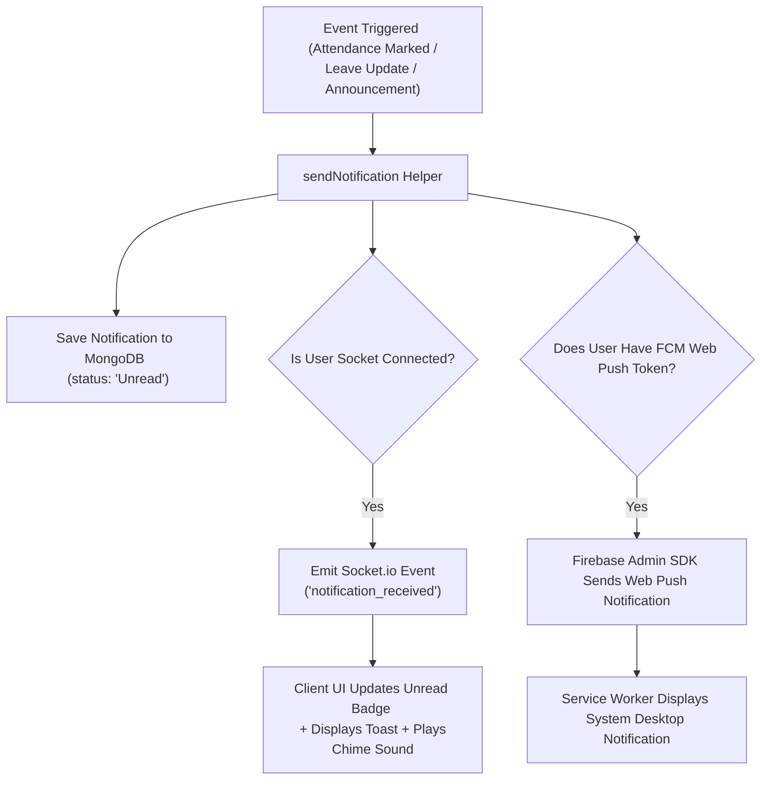

---

## 6. Student Leave Application & Authorization Flow

Step-by-step leave lifecycle from application submission to faculty authorization:

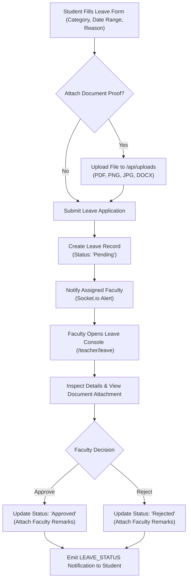

---

## 7. AI Attendance Prediction & Proxy Anomaly Detection Flow

Math trajectory calculation and security anomaly scanning flow:

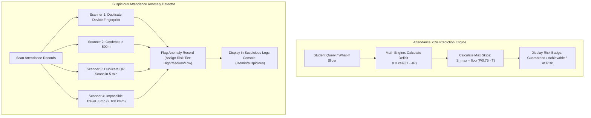

---

## 8. Advanced Attendance Rules Engine Evaluation & Sandbox Flow

Process flow showing rules caching, dynamic QR & GPS boundary check-in evaluation, and interactive sandbox simulator:

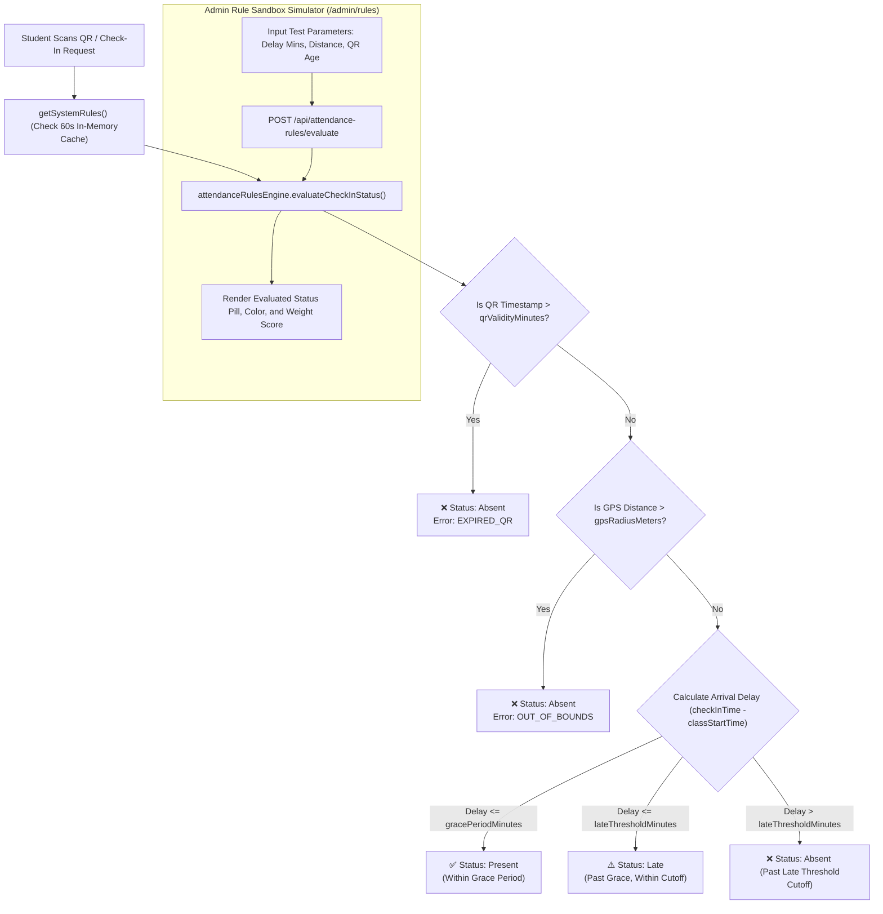

---

## 9. Attendance Session Engine & 4-Tier Hierarchy Flow

Hierarchy and Session Lifecycle workflow:

```mermaid
flowchart TD
    subgraph DomainHierarchy ["4-Tier Domain Hierarchy"]
        Subject["Subject (e.g. CS201 Data Structures)"] --> ClassSchedule["Scheduled Class (Room 302, 10:00 AM)"]
        ClassSchedule --> SessionInstance["Attendance Session (SESS-20260826-A1B2C3)"]
        SessionInstance --> StudentAtt["Student Attendance Record"]
    end

    subgraph SessionLifecycle ["Session Creation & Completion Lifecycle"]
        TeacherClick["Teacher Clicks 'Start Attendance'"] --> InitSession["POST /api/sessions/start"]
        InitSession --> GenId["Generate Unique Session ID + Start Time"]
        GenId --> GenQR["Sign 30s Dynamic JWT QR Token (Session Linked)"]
        GenQR --> SessionActive["Status: Active <br/> (Teacher UI Displays Session ID Badge & Countdown)"]
        
        SessionActive --> StudentScan["Student Scans QR Code"]
        StudentScan --> LinkAtt["Record Attendance (Linked to sessionId & classId)"]
        LinkAtt --> IncStats["$inc Session Stats: presentCount"]
        
        SessionActive --> TeacherStop["Teacher Clicks 'Stop Session'"]
        TeacherStop --> CompleteSession["POST /api/sessions/:id/stop"]
        CompleteSession --> FinalStats["Set Status: Completed & Record endTime"]
    end
```

---

## 10. Anti-Proxy Multi-Signal Risk Engine & Review Workflow

Phase 21 & 22 Multi-Signal evaluation pipeline and instructor review resolution workflow:

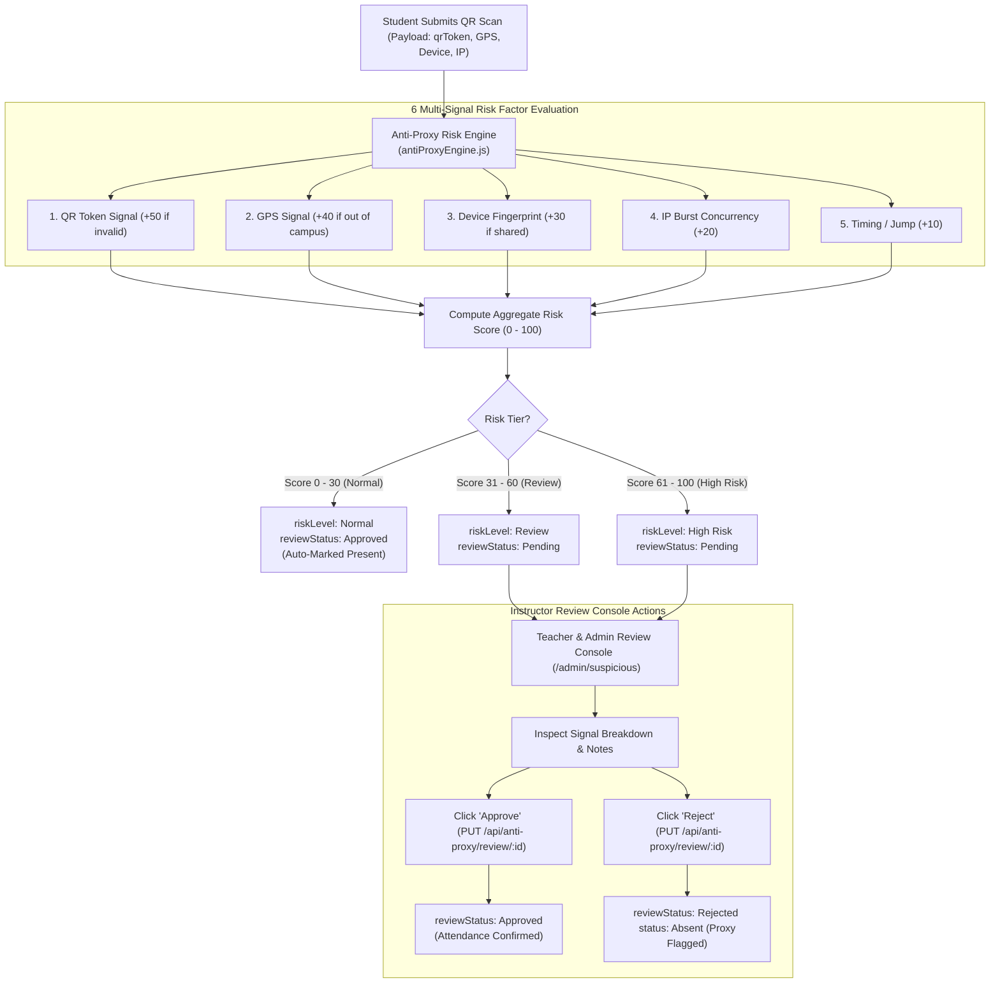

---

## 11. Attendance Correction Request & Approval Workflow

Phase 23 formal attendance modification workflow ensuring transparent auditability:


---

## 12. Complete Institutional Audit Logging & State Mutation Pipeline

Phase 24 complete audit trail logging 10 institutional actions with state diffs and reasons:

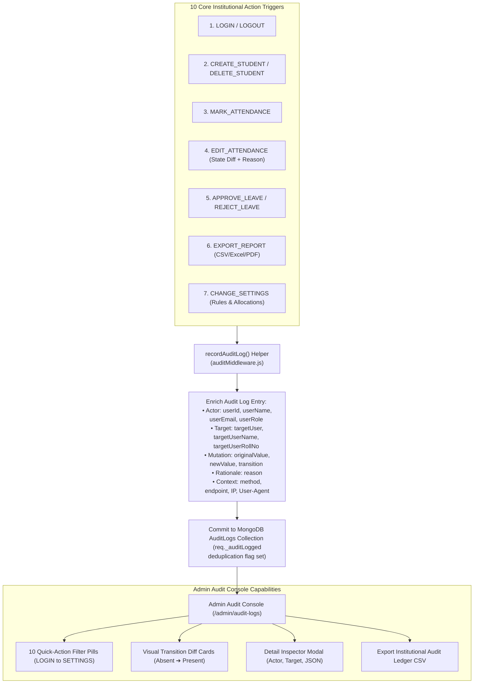

---

## 13. Phase 25 Advanced Notification Engine & Multi-Channel Pipeline

Centralized multi-channel notification engine, user preference filtering, smart recovery mathematics, and fan-out architecture:

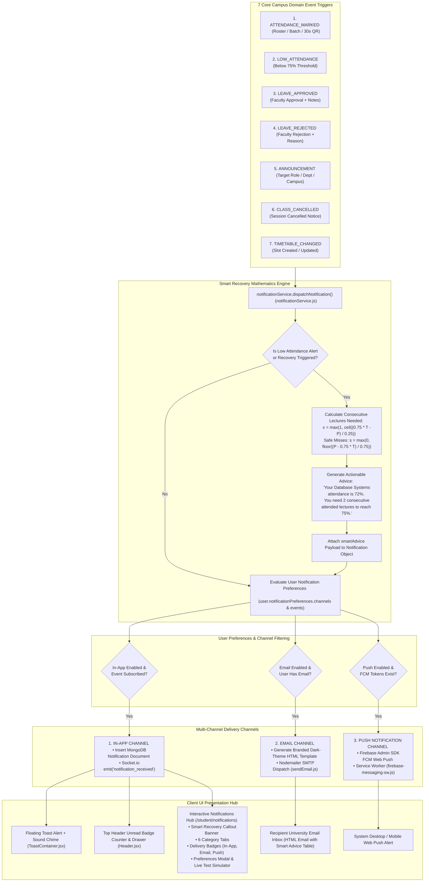

---

## 14. Phase 26 Attendance Forecasting Engine & Scenario Simulator

Comprehensive architecture of the Mathematical Forecasting Engine, 3 interactive scenario calculators, milestone ladder, and Natural Language AI Assistant routing:

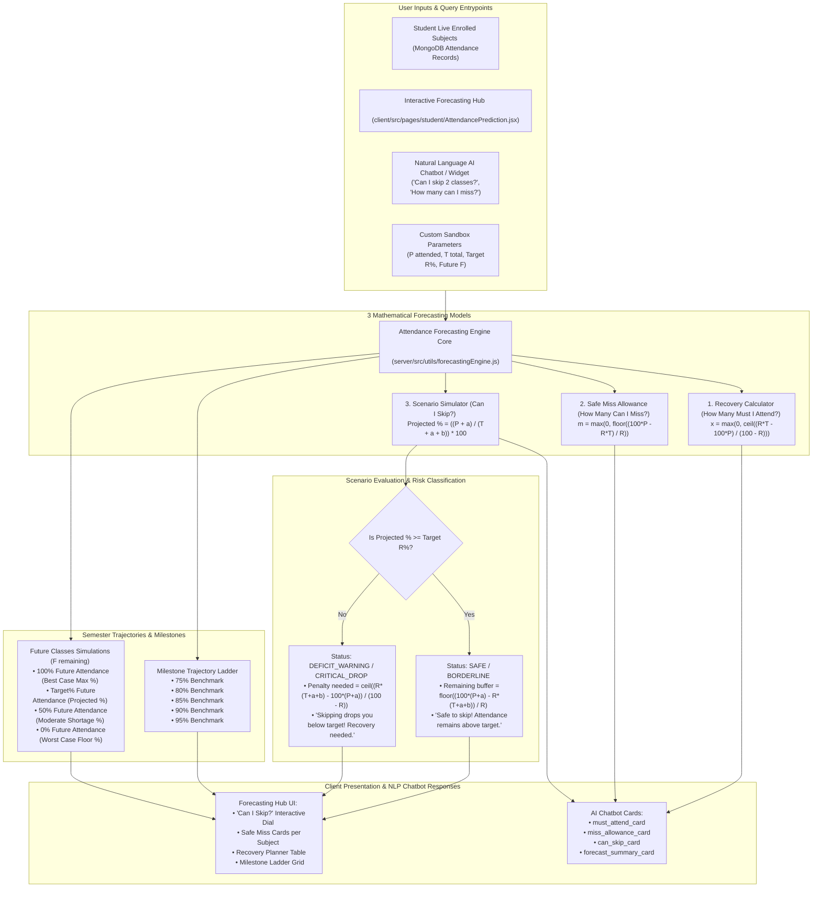

---

## 15. Phase 27 Personal Student Analytics & Visual Threshold Engine

End-to-end data aggregation pipeline from database entities, calculating the 9 core analytical metrics and rendering the visual attendance curve with the 75% minimum benchmark line:

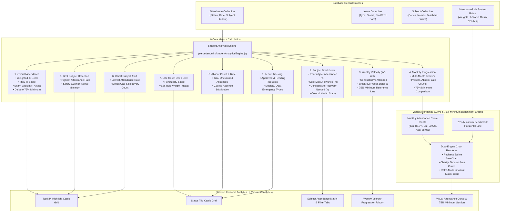

---

## 16. Phase 28: Teacher Analytics & Classroom Insights Engine

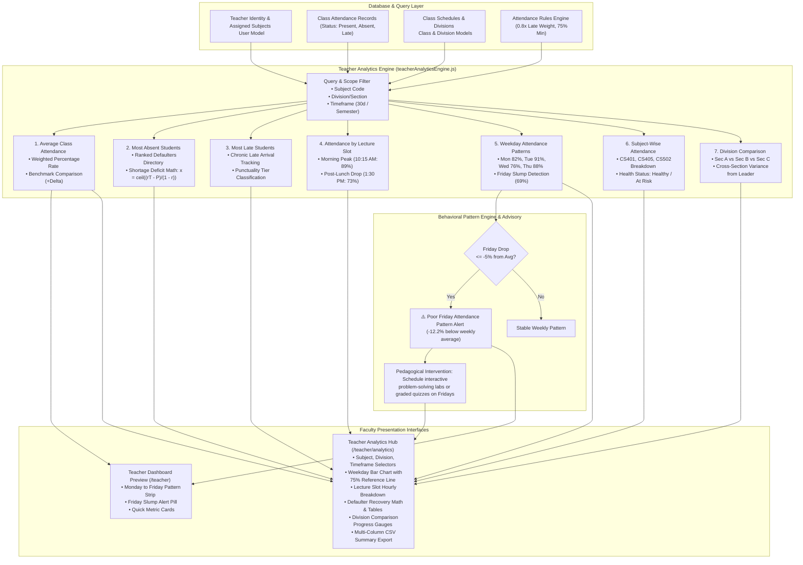

---

## 17. Phase 29: Admin Intelligence Dashboard & College Control Center Dataflow

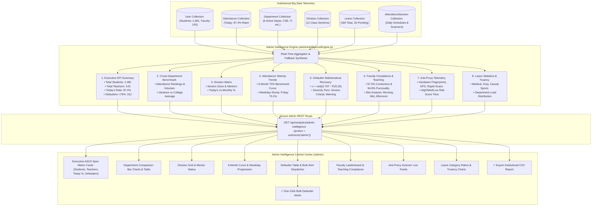

---

## 18. Phase 30: Automated Defaulter Management & Escalation Pipeline

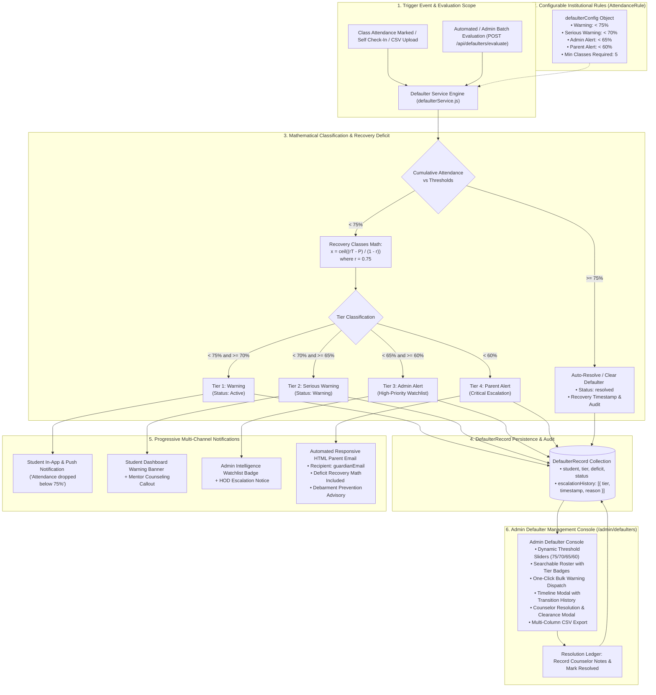

---

## 19. Phase 31: Parent/Guardian Portal & Ward Monitoring Lifecycle

The Phase 31 Parent/Guardian Portal provides transparent, real-time academic visibility for family members, governed by a strict server-side read-only security boundary:

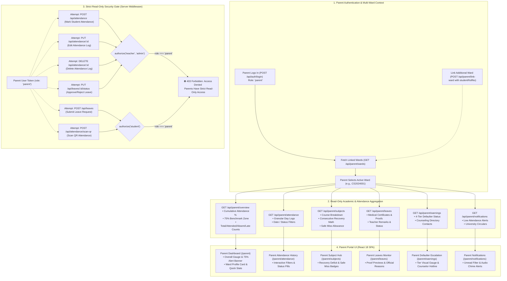

---

## 20. Phase 31: Document Verification & Security Storage Pipeline

### 20A. End-to-End Multi-Tier Document Verification Workflow
Process flow from student submission through faculty review to final administrative sanction:

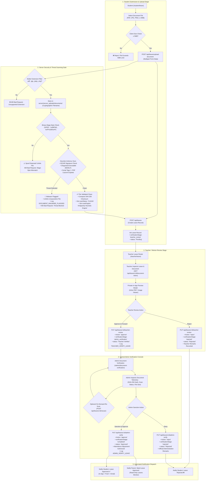

### 20B. Document Security, Binary Magic-Byte Inspection & Private Token Streaming Pipeline
Detailed architecture of the binary inspection, isolated storage, and temporary signed streaming subsystem:

```mermaid
flowchart LR
    subgraph ClientReq ["1. Client Request"]
        UserBrowser["Authenticated User <br/> (Student / Teacher / Admin / Parent)"]
        UserBrowser --> ReqToken["Request Preview Token <br/> (GET /api/leaves/:id/document-token)"]
    end

    subgraph AuthTokenServer ["2. Token Signing Engine (Server)"]
        ReqToken --> VerifyAccess{"Check User Rights: <br/> • Student Owner? <br/> • Teacher of Dept? <br/> • Admin Role? <br/> • Linked Parent of Ward?"}
        VerifyAccess -- No --> Return403["403 Forbidden"]
        VerifyAccess -- Yes --> SignJWT["Sign HMAC/JWT Token: <br/> • leaveId, userId, filePath, mimeType <br/> • Expires in 15 Minutes (900s)"]
        SignJWT --> TokenResp["Return token & secureStreamUrl"]
    end

    subgraph StreamPipe ["3. Private Secure Stream Engine"]
        TokenResp --> UserBrowser
        UserBrowser --> StreamReq["Inline Display Request: <br/> GET /api/leaves/document-stream/:token"]
        StreamReq --> TokenVerify{"Verify JWT Token <br/> & Expiry Window"}
        TokenVerify -- Expired / Invalid --> Return401["401 Unauthorized / Token Expired"]
        TokenVerify -- Valid --> ResolvePath["Resolve Isolated File Path: <br/> server/secure_uploads/documents/doc-*.ext"]
        ResolvePath --> CheckDisk{"File Exists <br/> on Disk?"}
        CheckDisk -- No --> Return404["404 Not Found"]
        CheckDisk -- Yes --> SendHeaders["Set Security Headers: <br/> • Content-Type: application/pdf | image/* <br/> • Content-Disposition: inline <br/> • X-Content-Type-Options: nosniff <br/> • Cache-Control: private, no-store"]
        SendHeaders --> StreamData["Pipe Binary ReadStream to Response"]
        StreamData --> RenderPreview["Secure In-App Preview Rendered <br/> (No Auth Headers Leaked in Browser URL)"]
    end
```

---

## 21. Phase 33: Progressive Web App (PWA) & Mobile Architecture

### 21A. Service Worker Caching, Offline Shell & Network Lifecycle
Architecture of the Service Worker caching layer, navigation fallback, and reactive online/offline detection:

```mermaid
flowchart TD
    subgraph ClientInit ["1. Client Launch & Registration"]
        BrowserWindow["Mobile / Desktop Browser"] --> MainJSX["main.jsx Bootloader"]
        MainJSX --> RegSW{"'serviceWorker' in navigator?"}
        RegSW -- Yes --> Register["navigator.serviceWorker.register('/sw.js')"]
        Register --> InstallEvent["SW 'install' Event Triggered"]
        InstallEvent --> PreCache["Pre-cache Static App Shell: <br/> • '/', '/index.html' <br/> • '/offline.html' <br/> • '/manifest.webmanifest' <br/> • Vector & Raster Icons (/icons/*)"]
        PreCache --> ActivateEvent["SW 'activate' Event Triggered"]
        ActivateEvent --> CleanOld["Purge Stale Cache Versions <br/> Activate 'campusattend-v1'"]
    end

    subgraph FetchPipeline ["2. Intelligent Multi-Strategy Fetch Interceptor"]
        BrowserWindow --> UserRequest["HTTP Request (Fetch Event)"]
        UserRequest --> ReqType{"Request Classification"}
        
        ReqType -- "Static Asset (JS, CSS, Font, Img)" --> CacheFirst["Cache-First Strategy <br/> (caches.match(event.request))"]
        CacheFirst --> AssetInCache{"Found in Cache?"}
        AssetInCache -- Yes --> ReturnCachedAsset["Return Cached Asset (0ms Latency)"]
        AssetInCache -- No --> FetchNetAsset["Fetch from Network & Save to Cache"]
        FetchNetAsset --> ReturnNetAsset["Return Asset to Client"]

        ReqType -- "Navigation (mode === 'navigate')" --> NetFirst["Network-First Strategy <br/> (fetch(event.request))"]
        NetFirst --> NetAlive{"Network Online?"}
        NetAlive -- Yes --> ReturnHTML["Return Fresh Page HTML <br/> Update Cache Copy"]
        NetAlive -- No --> MatchShell{"Cached Shell <br/> Available?"}
        MatchShell -- Yes --> ReturnShell["Return Pre-cached Page Shell"]
        MatchShell -- No --> ReturnOfflineHTML["Serve Glassmorphic offline.html <br/> (Offline Fallback Page)"]

        ReqType -- "API Mutation (POST/PUT/DELETE)" --> ApiGuard["API Request Interceptor"]
        ApiGuard --> ApiOnline{"Network Online?"}
        ApiOnline -- Yes --> PassApi["Forward to Backend REST API"]
        ApiOnline -- No --> OfflineJSON["Return 503 JSON: <br/> { offline: true, message: 'Currently offline...' }"]
    end

    subgraph ConnectivityTelemetry ["3. Reactive Network State Machine"]
        WindowEvents["window.addEventListener('online' / 'offline')"] --> NetHook["useNetworkStatus() Hook"]
        NetHook --> OfflineToast["OfflineBanner.jsx Component <br/> • Floating Glassmorphic Alert <br/> • Auto-hides on Reconnection"]
        NetHook --> RetryTrigger["User Clicks 'Retry Connection'"]
        RetryTrigger --> NetFirst
    end
```

### 21B. Device Camera Hardware QR Scanner & Dual Detection Pipeline
Complete process flow from user interaction to hardware video streaming, dual barcode analysis, sensor telemetry, and attendance submission:

```mermaid
flowchart TD
    subgraph TriggerStage ["1. Scanner Launch & Hardware Permissions"]
        UserAction["Student Taps 'Scan QR' <br/> (MobileBottomNav / Dashboard)"] --> OpenModal["Open StudentQRScannerModal.jsx"]
        OpenModal --> ReqMedia["Request Device Camera: <br/> navigator.mediaDevices.getUserMedia <br/> { video: { facingMode: 'environment' } }"]
        ReqMedia --> PermGranted{"Camera Permission Granted?"}
        PermGranted -- Denied --> FallbackTab["Switch to Manual Token Tab <br/> (Direct String Input)"]
        PermGranted -- Granted --> VideoStream["Bind HTML5 &lt;video&gt; Stream"]
    end

    subgraph HardwareControls ["2. Real-Time Camera Hardware Controls"]
        VideoStream --> LensToggle{"User Taps Lens Switcher"}
        LensToggle --> SwitchFacing["Toggle facingMode: <br/> 'environment' &harr; 'user'"]
        SwitchFacing --> ReqMedia

        VideoStream --> TorchToggle{"User Taps Flashlight"}
        TorchToggle --> ApplyTorch["track.applyConstraints <br/> { advanced: [{ torch: true/false }] }"]
    end

    subgraph DualDetectionEngine ["3. Dual-Engine Barcode Analysis Pipeline"]
        VideoStream --> FrameLoop["RequestAnimationFrame Scan Loop <br/> (Render Frame to Hidden &lt;canvas&gt;)"]
        FrameLoop --> CheckNative{"window.BarcodeDetector <br/> Supported?"}
        
        CheckNative -- Yes (Chromium/Android) --> NativeScan["Native BarcodeDetector Engine <br/> (Hardware Accelerated)"]
        NativeScan --> NativeResult{"QR Code Detected?"}
        
        CheckNative -- No (Safari/iOS/Firefox) --> JsQRScan["Pure-JS jsQR Engine <br/> (Analyze Canvas ImageData)"]
        JsQRScan --> JsResult{"QR Code Detected?"}

        NativeResult -- No --> FrameLoop
        JsResult -- No --> FrameLoop

        NativeResult -- Yes --> ExtractToken["Extract Decoded Token String"]
        JsResult -- Yes --> ExtractToken
    end

    subgraph SensoryFeedback ["4. Sensory Confirmation & Payload Packaging"]
        ExtractToken --> AudioFeedback["HTML5 Web Audio API: playScanBeep() <br/> (880Hz Sine Wave Acoustic Chime)"]
        ExtractToken --> VisualLaser["Animate Laser Sweep & Lock Reticle <br/> (.animate-scan-laser)"]
        ExtractToken --> GetLocation["Query Geolocation: <br/> navigator.geolocation.getCurrentPosition()"]
        ExtractToken --> GetFingerprint["Query Device Fingerprint & IP Cluster"]
        
        GetLocation --> PackagePayload["Package Attendance Submission Payload: <br/> { qrToken, latitude, longitude, deviceFingerprint }"]
        GetFingerprint --> PackagePayload
    end

    subgraph ServerSubmission ["5. Backend Verification & Attendance Marking"]
        PackagePayload --> PostApi["POST /api/attendance/scan-qr"]
        PostApi --> ServerVerify{"Backend Anti-Proxy Engine: <br/> • 30s Dynamic Secret Valid? <br/> • Within 500m Campus Geofence? <br/> • Active Attendance Session? <br/> • Device Collision Free?"}
        ServerVerify -- Valid --> SuccessUI["Display Emerald Checkmark Confirmed <br/> • Auto-close modal after 2.4s <br/> • Update Attendance Score %"]
        ServerVerify -- Invalid --> ErrorUI["Display Risk Warning / Error Banner <br/> Allow Rescan after 3.0s"]
    end
```

---

## 22. Phase 34 Offline Attendance Sync & Multi-Strategy Conflict Resolution Flow

Complete lifecycle showing local offline attendance recording in browser IndexedDB, automatic background reconnection sync, and multi-strategy conflict resolution:

```mermaid
flowchart TD
    subgraph OfflineRecordingStage ["1. Classroom Attendance Taking (Local-First)"]
        TeacherUI["Teacher Opens TakeAttendance.jsx <br/> (Selects Course CS401 & Section A)"] --> CheckCache{"Cached Roster in <br/> IndexedDB rosterCache?"}
        CheckCache -- Yes --> LoadLocal["Render Pre-Cached Student Roster"]
        CheckCache -- No --> LoadDefault["Render Default Student Roster <br/> (Pre-cache in IndexedDB)"]
        
        LoadLocal --> MarkRoster["Instructor Marks Roster <br/> (Present / Absent / Late / Remarks)"]
        LoadDefault --> MarkRoster
        
        MarkRoster --> ClickSubmit["Click 'Submit Class Attendance'"]
        ClickSubmit --> CheckOnline{"navigator.onLine <br/> Connectivity Status?"}
        
        CheckOnline -- Offline --> QueueItem["Enqueues Batch to IndexedDB: <br/> • Database: CampusAttendOfflineDB <br/> • Store: attendanceQueue <br/> • Stamped with ISO clientTimestamp"]
        CheckOnline -- Online --> TryDirect["Attempt Direct Server Submission <br/> POST /api/attendance/offline-sync"]
        TryDirect -- Network Dropout --> QueueItem
    end

    subgraph AutoSyncPipeline ["2. Reconnection & Auto-Sync Pipeline"]
        QueueItem --> SavedToast["Display Amber Offline Toast: <br/> 'Records safely queued locally'"]
        SavedToast --> AwaitNet["Wait for Connection Restored"]
        AwaitNet --> OnlineEvent["window.addEventListener('online')"]
        OnlineEvent --> DebounceNet["1.5s Network Stability Debounce"]
        DebounceNet --> TriggerSync["OfflineSyncContext: syncAllPending()"]
        TriggerSync --> PostSync["POST /api/attendance/offline-sync <br/> { batchId, records, conflictStrategy: 'detect_only' }"]
    end

    subgraph ServerConflictEngine ["3. Backend Conflict Detection Engine"]
        PostSync --> QueryServer["Query Server Database: <br/> • Existing Attendance on date/subject? <br/> • Approved Student Leaves in Leave model?"]
        QueryServer --> DiffCheck{"Status Difference <br/> or Discrepancy?"}
        
        DiffCheck -- No Conflict --> CleanCommit["Commit All Records to MongoDB <br/> isOfflineSynced: true, conflictResolution: 'NONE'"]
        DiffCheck -- Conflict Detected --> SplitItems["Commit Clean Records & Flag Conflicts: <br/> • Local Record: Status, Timestamp, Notes <br/> • Server Record: Status, Source, Reason"]
    end

    subgraph ConflictResolutionStrategy ["4. Multi-Strategy Conflict Resolution"]
        SplitItems --> ReturnConflict["Return HTTP 200: { hasConflicts: true, conflicts: [...] }"]
        ReturnConflict --> OpenModal["Auto-Launch ConflictResolutionModal.jsx <br/> Side-by-Side Comparison Diff View"]
        
        OpenModal --> ChooseStrategy{"Instructor Selects Resolution Strategy"}
        
        ChooseStrategy -- Smart Precedence --> SmartLogic["Smart Precedence Applied: <br/> • Approved Leaves > Absent/Present <br/> • Anti-Proxy QR Scan > Unmarked Absent <br/> • Latest Timestamp Breaks Ties"]
        ChooseStrategy -- Teacher Authority --> LocalWins["Teacher Authority (local_wins): <br/> • Classroom Roster Overwrites Server <br/> • conflictResolution: 'LOCAL_OVERRIDE'"]
        ChooseStrategy -- Preserve Server --> ServerWins["Server Preserved (server_wins): <br/> • Verified Cloud Record Locked <br/> • conflictResolution: 'SERVER_PRESERVED'"]
        ChooseStrategy -- Interactive Per-Student --> CustomLogic["Per-Student Toggles Applied <br/> POST /api/attendance/resolve-conflicts <br/> • conflictResolution: 'MANUAL_RESOLVED'"]
        
        SmartLogic --> CommitFinal["Commit Final Resolved Records to MongoDB"]
        LocalWins --> CommitFinal
        ServerWins --> CommitFinal
        CustomLogic --> CommitFinal
    end

    subgraph FinalTelemetry ["5. Telemetry, Auditing & State Sync"]
        CleanCommit --> AuditLog["Record Audit Log: <br/> action: OFFLINE_ATTENDANCE_SYNC"]
        CommitFinal --> AuditLog
        
        AuditLog --> UpdateLocal["Update Local Queue Item: <br/> syncStatus: 'synced', conflictData: null"]
        UpdateLocal --> LogHistory["Append to IndexedDB syncHistory Store"]
        UpdateLocal --> BadgeGreen["OfflineSyncBadge: Display Cloud Checkmark (Synced)"]
        CommitFinal --> SendAlerts["Trigger Student Notifications & Defaulter Engine"]
    end
```


