# System Architecture & Workflow Diagrams

This document contains comprehensive flowcharts and system diagrams for the **Attendance Management System**, rendered using standard GitHub Flavored Markdown [`mermaid`](https://mermaid.js.org/) syntax.

---

## 📋 Table of Contents
1. [Dynamic Academic Hierarchy Tree](#1-dynamic-academic-hierarchy-tree)
2. [Student Batch Promotion Engine Workflow](#2-student-batch-promotion-engine-workflow)
3. [30-Second Dynamic QR Attendance & Security Verification Flow](#3-30-second-dynamic-qr-attendance--security-verification-flow)
4. [Overall System Architecture & Data Pipeline](#4-overall-system-architecture--data-pipeline)
5. [Real-Time Socket.io & FCM Web Push Notification Flow](#5-real-time-socketio--fcm-web-push-notification-flow)
6. [Student Leave Application & Authorization Flow](#6-student-leave-application--authorization-flow)
7. [AI Attendance Prediction & Proxy Anomaly Detection Flow](#7-ai-attendance-prediction--proxy-anomaly-detection-flow)
8. [Advanced Attendance Rules Engine Evaluation & Sandbox Flow](#8-advanced-attendance-rules-engine-evaluation--sandbox-flow)
9. [Attendance Session Engine & 4-Tier Hierarchy Flow](#9-attendance-session-engine--4-tier-hierarchy-flow)
10. [Anti-Proxy Multi-Signal Risk Engine & Review Workflow](#10-anti-proxy-multi-signal-risk-engine--review-workflow)
11. [Attendance Correction Request & Approval Workflow](#11-attendance-correction-request--approval-workflow)
12. [Complete Institutional Audit Logging & State Mutation Pipeline](#12-complete-institutional-audit-logging--state-mutation-pipeline)
13. [Phase 25 Advanced Notification Engine & Multi-Channel Pipeline](#13-phase-25-advanced-notification-engine--multi-channel-pipeline)
14. [Phase 26 Attendance Forecasting Engine & Scenario Simulator](#14-phase-26-attendance-forecasting-engine--scenario-simulator)
15. [Phase 27 Personal Student Analytics & Visual Threshold Engine](#15-phase-27-personal-student-analytics--visual-threshold-engine)

---

## 1. Dynamic Academic Hierarchy Tree

The Phase 18 Academic Engine organizes institutional data into a dynamic 5-tier hierarchy, replacing hard-coded term strings:

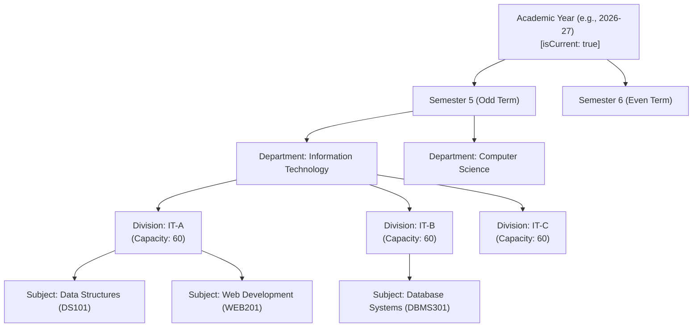

---

## 2. Student Batch Promotion Engine Workflow

Process flow for promoting student cohorts from a current academic term to a target academic term:

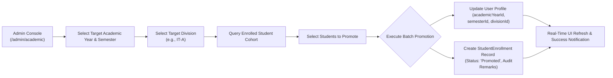

---

## 3. 30-Second Dynamic QR Attendance & Security Verification Flow

Complete multi-layered security verification process when a student scans a 30-second expiring QR code:

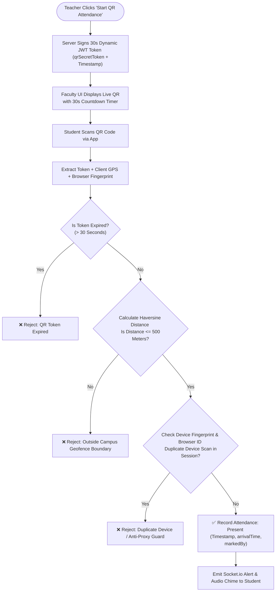

---

## 4. Overall System Architecture & Data Pipeline

3-Tier Architecture showing Client SPA, Security Gateway, Application Services, and MongoDB Storage:

```mermaid
flowchart TB
    subgraph ClientLayer ["Client Layer (React 18 + Vite + Tailwind CSS)"]
        UI_Student["Student Portal (/student)"]
        UI_Teacher["Teacher Portal (/teacher)"]
        UI_Admin["Admin Console (/admin)"]
    end

    subgraph SecurityGateway ["Security Layer & API Gateway"]
        Helmet["Helmet Security Headers"]
        RateLimiter["Sliding-Window Rate Limiter"]
        XSS["XSS Payload Sanitizer"]
        JWT_RBAC["JWT Verification & RBAC Guards"]
        AuditMiddleware["Non-Blocking Audit Event Logger"]
    end

    subgraph ControllerLayer ["Application Controllers (Express.js)"]
        AuthCtrl["Auth & User Controller"]
        AttCtrl["Attendance & QR Controller"]
        AcadCtrl["Academic Engine Controller"]
        AICtrl["AI Predictor & Anomaly Detector"]
        AnalyticCtrl["Analytics Dashboard Controller"]
        NotifCtrl["Notification & FCM Controller"]
        AuditCtrl["Audit & Correction Controllers"]
    end

    subgraph DB ["Database & Storage Layer (MongoDB / Mongoose)"]
        Col_Users[("Users Collection")]
        Col_Academic[("AcademicYears, Semesters, Divisions")]
        Col_Enrollment[("StudentEnrollments")]
        Col_Att[("Attendance & Sessions")]
        Col_Correction[("AttendanceCorrections")]
        Col_Audit[("AuditLogs (10 Actions + State Diffs)")]
    end

    ClientLayer -->|HTTP REST JSON / JWT Bearer| SecurityGateway
    SecurityGateway --> ControllerLayer
    ControllerLayer --> DB
```

---

## 5. Real-Time Socket.io & FCM Web Push Notification Flow

Architecture of event-driven notification dispatch system across WebSockets and Firebase Cloud Messaging:

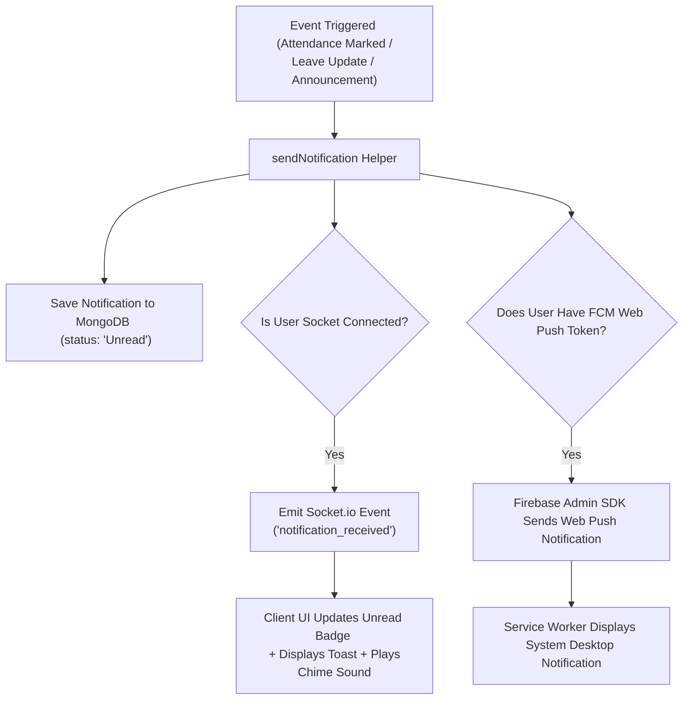

---

## 6. Student Leave Application & Authorization Flow

Step-by-step leave lifecycle from application submission to faculty authorization:

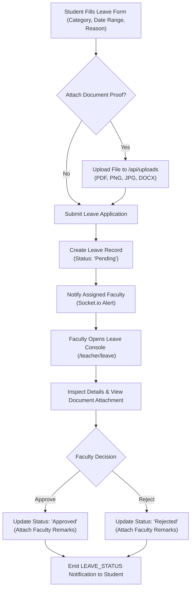

---

## 7. AI Attendance Prediction & Proxy Anomaly Detection Flow

Math trajectory calculation and security anomaly scanning flow:

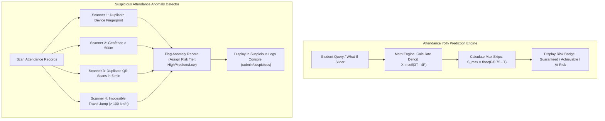

---

## 8. Advanced Attendance Rules Engine Evaluation & Sandbox Flow

Process flow showing rules caching, dynamic QR & GPS boundary check-in evaluation, and interactive sandbox simulator:

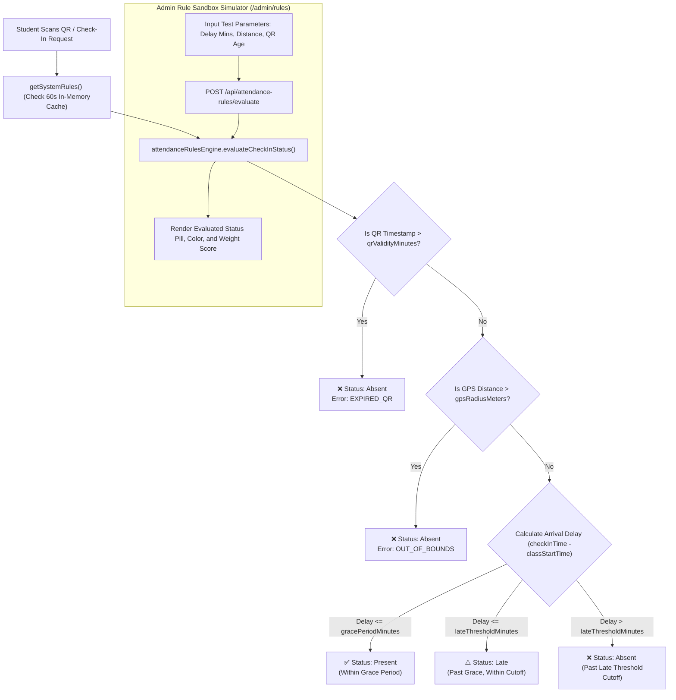

---

## 9. Attendance Session Engine & 4-Tier Hierarchy Flow

Hierarchy and Session Lifecycle workflow:

```mermaid
flowchart TD
    subgraph DomainHierarchy ["4-Tier Domain Hierarchy"]
        Subject["Subject (e.g. CS201 Data Structures)"] --> ClassSchedule["Scheduled Class (Room 302, 10:00 AM)"]
        ClassSchedule --> SessionInstance["Attendance Session (SESS-20260826-A1B2C3)"]
        SessionInstance --> StudentAtt["Student Attendance Record"]
    end

    subgraph SessionLifecycle ["Session Creation & Completion Lifecycle"]
        TeacherClick["Teacher Clicks 'Start Attendance'"] --> InitSession["POST /api/sessions/start"]
        InitSession --> GenId["Generate Unique Session ID + Start Time"]
        GenId --> GenQR["Sign 30s Dynamic JWT QR Token (Session Linked)"]
        GenQR --> SessionActive["Status: Active <br/> (Teacher UI Displays Session ID Badge & Countdown)"]
        
        SessionActive --> StudentScan["Student Scans QR Code"]
        StudentScan --> LinkAtt["Record Attendance (Linked to sessionId & classId)"]
        LinkAtt --> IncStats["$inc Session Stats: presentCount"]
        
        SessionActive --> TeacherStop["Teacher Clicks 'Stop Session'"]
        TeacherStop --> CompleteSession["POST /api/sessions/:id/stop"]
        CompleteSession --> FinalStats["Set Status: Completed & Record endTime"]
    end
```

---

## 10. Anti-Proxy Multi-Signal Risk Engine & Review Workflow

Phase 21 & 22 Multi-Signal evaluation pipeline and instructor review resolution workflow:

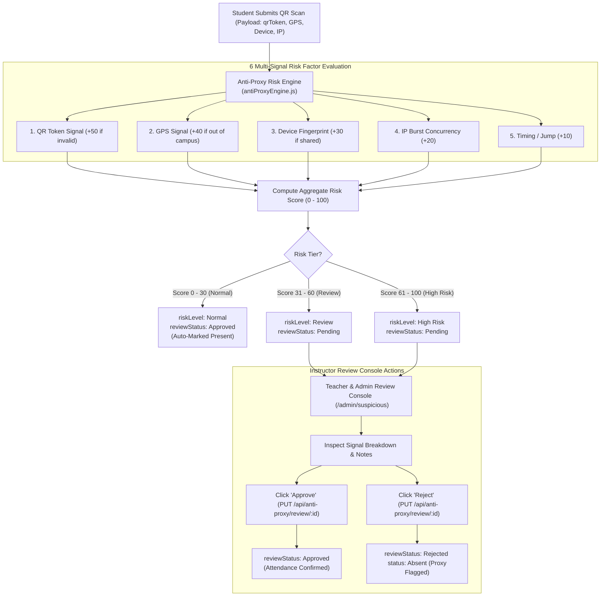

---

## 11. Attendance Correction Request & Approval Workflow

Phase 23 formal attendance modification workflow ensuring transparent auditability:

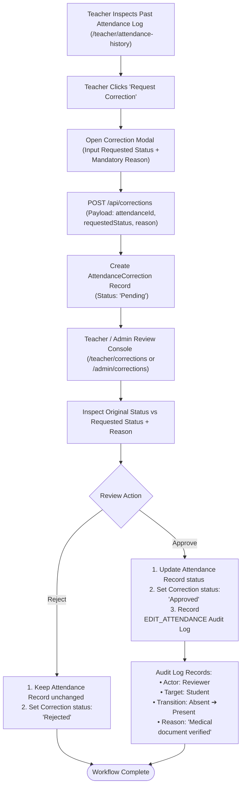

---

## 12. Complete Institutional Audit Logging & State Mutation Pipeline

Phase 24 complete audit trail logging 10 institutional actions with state diffs and reasons:

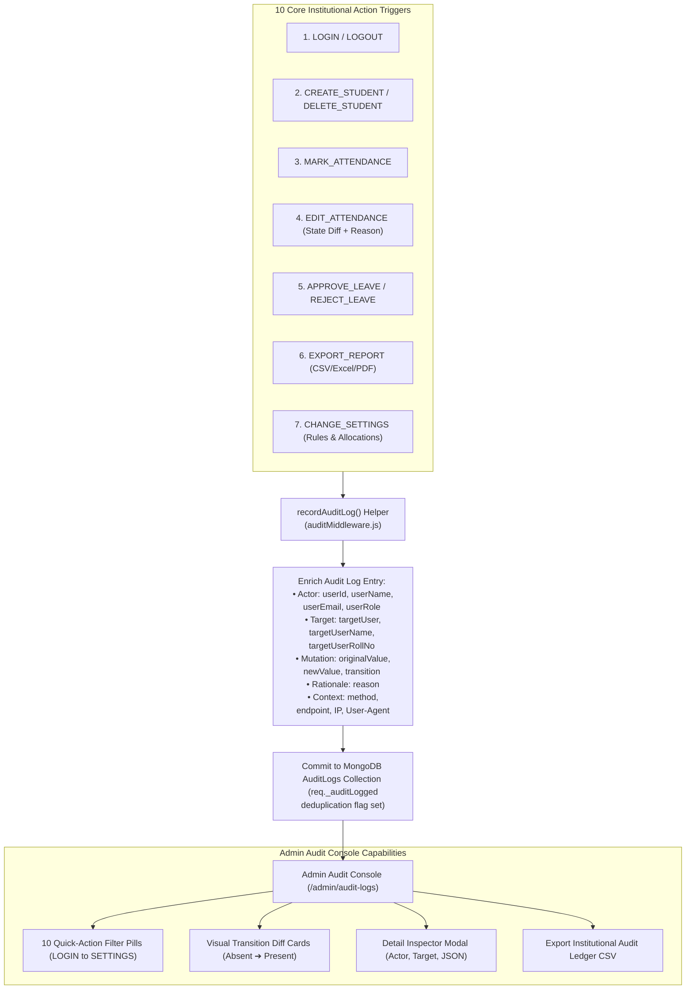

---

## 13. Phase 25 Advanced Notification Engine & Multi-Channel Pipeline

Centralized multi-channel notification engine, user preference filtering, smart recovery mathematics, and fan-out architecture:

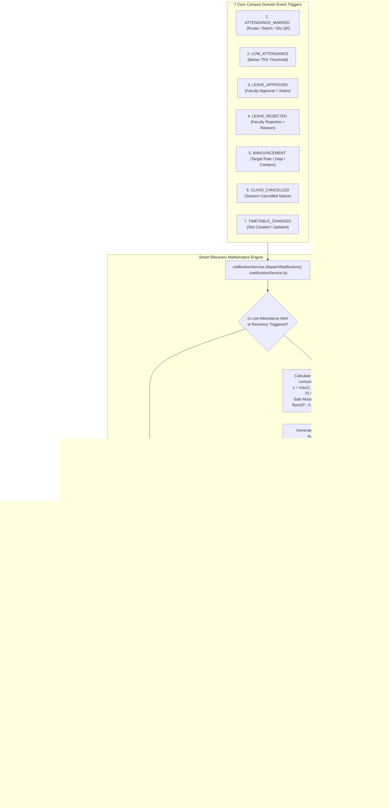

---

## 14. Phase 26 Attendance Forecasting Engine & Scenario Simulator

Comprehensive architecture of the Mathematical Forecasting Engine, 3 interactive scenario calculators, milestone ladder, and Natural Language AI Assistant routing:

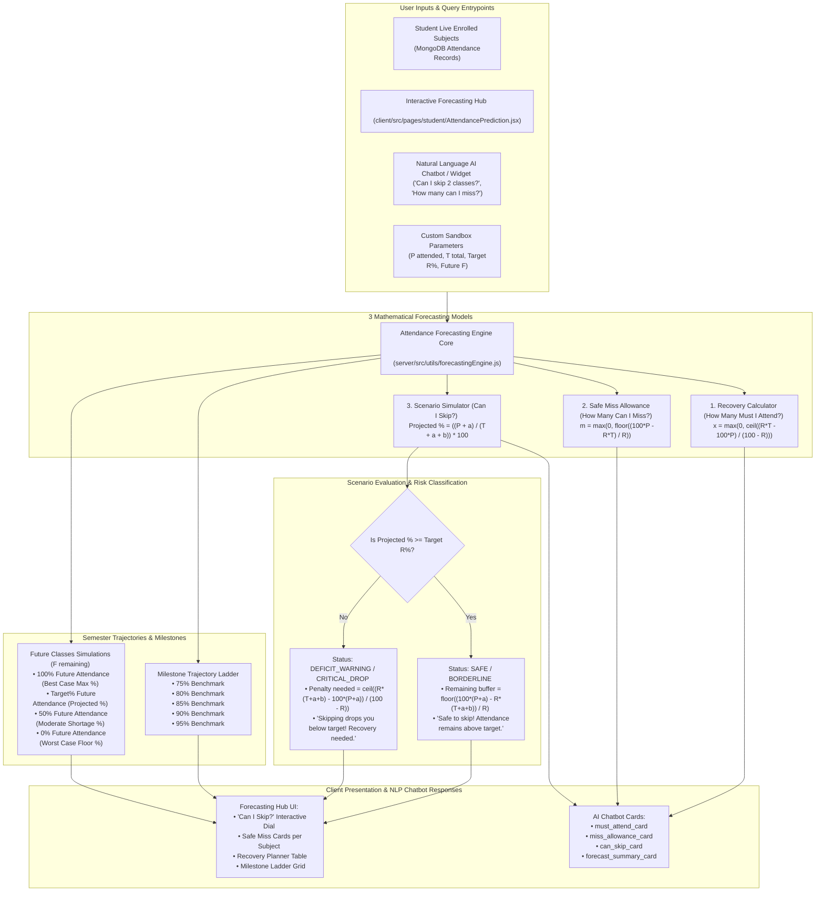

---

## 15. Phase 27 Personal Student Analytics & Visual Threshold Engine

End-to-end data aggregation pipeline from database entities, calculating the 9 core analytical metrics and rendering the visual attendance curve with the 75% minimum benchmark line:

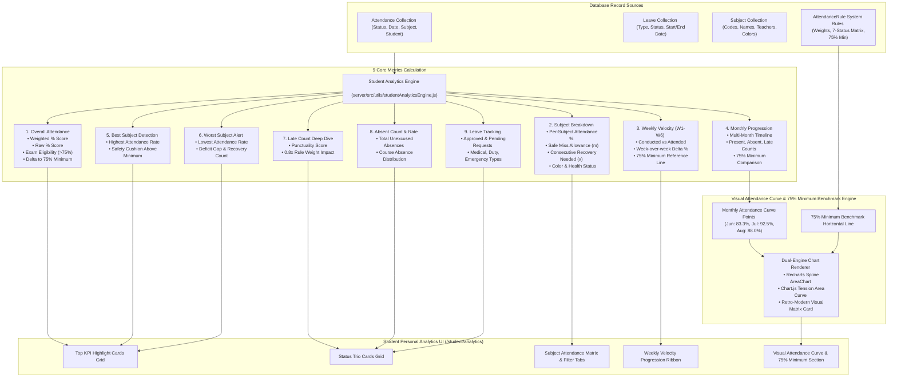

---

## 28. Phase 28 – Teacher Analytics & Classroom Insights Engine

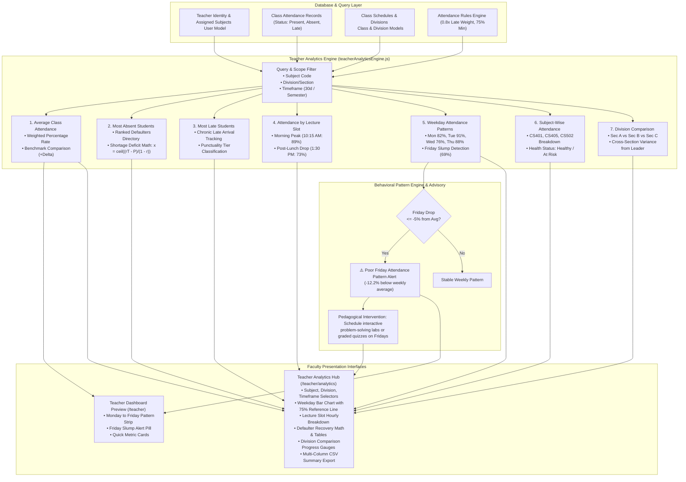

